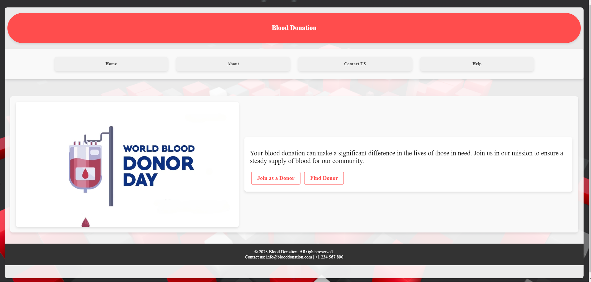
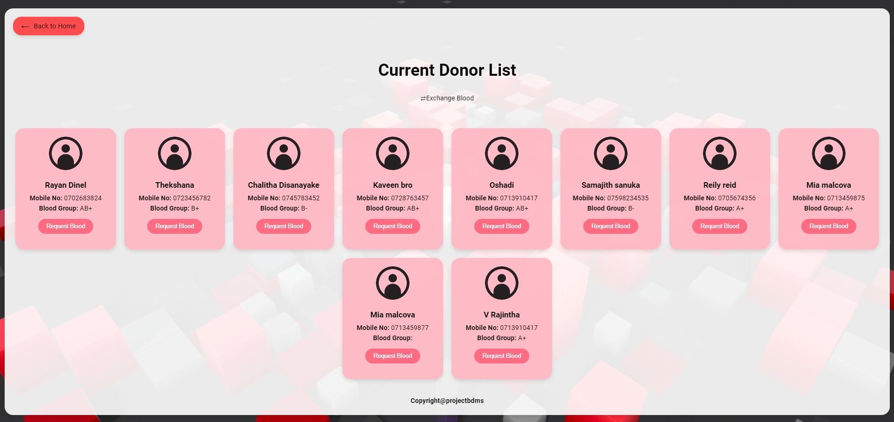
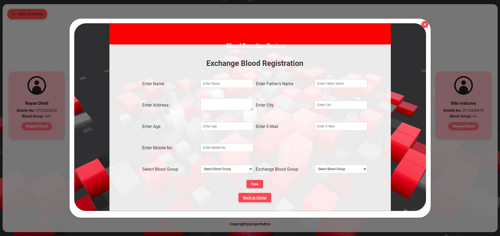
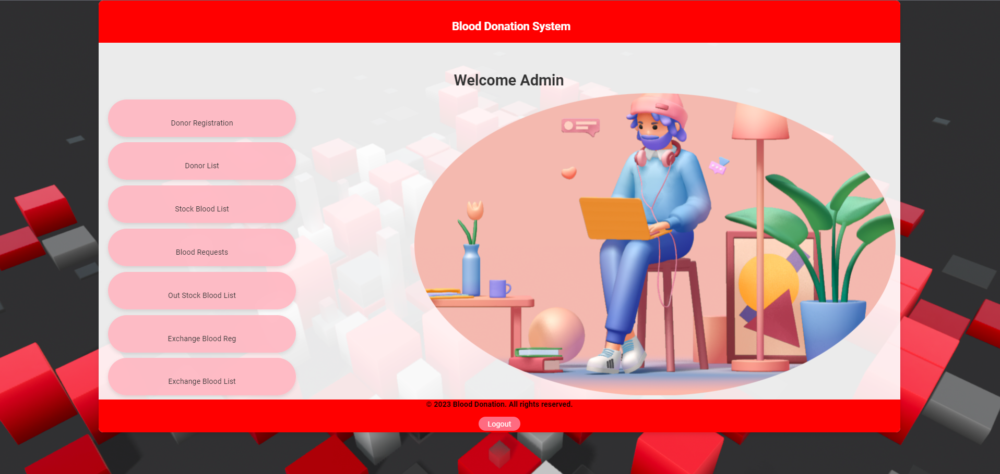
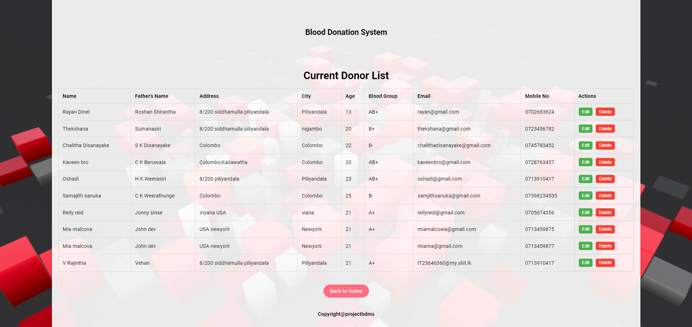
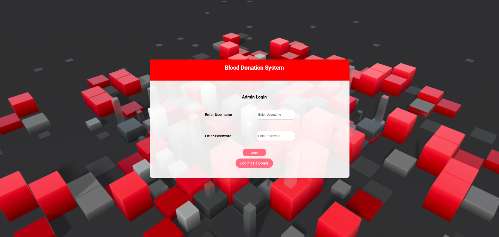
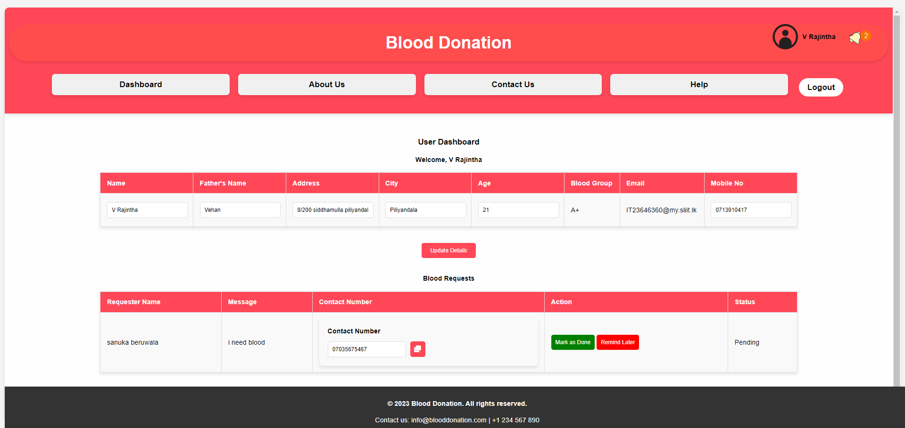

# Blood_Donation_System

-------------------------------------------------------INSTRUCTIONS-------------------------------------------------------------------

**Install xampp**
- Run apache and MySQL servers through xampp
- Put the project folder to /xammp/htdocs path
- import database ---> mypro_bbms.sql
- Open your browser and browse http://localhost/bbms/user_home.php (this is the main user page)

**Extra**             ----> Used bind values for php 
		(The bindValue method is used to bind a value to a parameter in a prepared statement. This helps prevent SQL injection   attacks by ensuring that the values are properly escaped.)
    
           ----> Used Session management 
           ----> ER diagram provided

